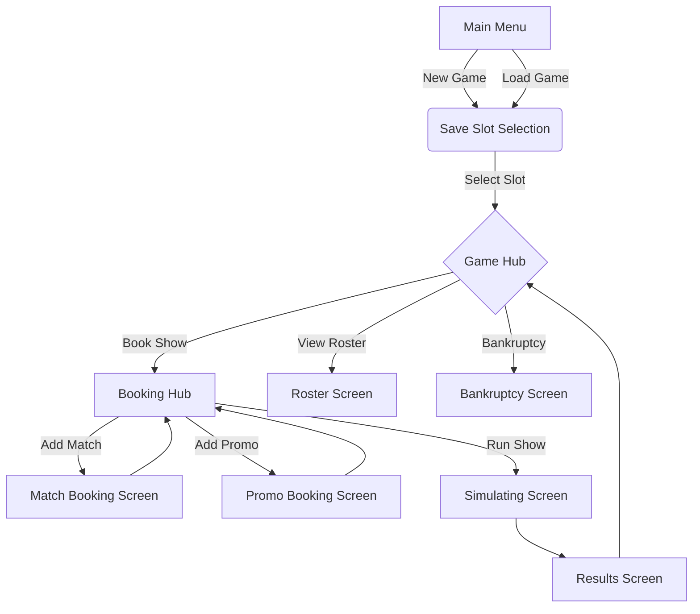

# User Journey

This document outlines the user's journey through the WrestleGM application, from the main menu to running a show and viewing the results.

## Application Flow Diagram

## Screen Descriptions

### Main Menu

The first screen the user sees. It provides the following options:

-   **New Game:** Starts a new game of WrestleGM.
-   **Load Game:** Loads a previously saved game.
-   **Quit:** Exits the application.

### Save Slot Selection

When starting a new game or loading a saved one, the user is presented with a list of save slots. They can choose a slot to save their new game or load an existing one.

### Game Hub

The central screen for an active game. From here, the user can:

-   See the current date (show number) and their money.
-   Choose to book the next show.
-   View their wrestler roster.
-   View the results of the previous show.

### Booking Hub

This is where the player acts as the booker. The screen shows the card for the upcoming show, which consists of a series of empty slots. The user can select a slot to book either a match or a promo. They can also see the projected cost of the show as they book it.

### Match Booking Screen

This screen allows the user to book a match. They must:

1.  Select the wrestlers for the match.
2.  Choose the match type (e.g., Singles, Tag Team).
3.  Choose a specific match stipulation (e.g., "Normal", "First Blood").

The screen displays information about the wrestlers, including their stats and any existing rivalries between them.

### Promo Booking Screen

A simpler screen for booking a promo segment. The user selects a single wrestler to cut a promo.

### Simulating Screen

Once the show is fully booked, the user can choose to run it. This screen is a temporary loading screen displayed while the simulation engine processes the show.

### Results Screen

After the simulation, this screen displays the results of the show, including:

-   The winner of each match.
-   The star rating of each match, promo, and the overall show.
-   The financial breakdown: show costs, income, and profit/loss.
-   Changes in wrestler stats.

### Roster Screen

This screen displays a list of all wrestlers in the promotion, showing their key stats like Popularity, Stamina, and Mic Skill.

### Bankruptcy Screen

If the player's money drops to zero or below, the game ends, and this screen is displayed.
